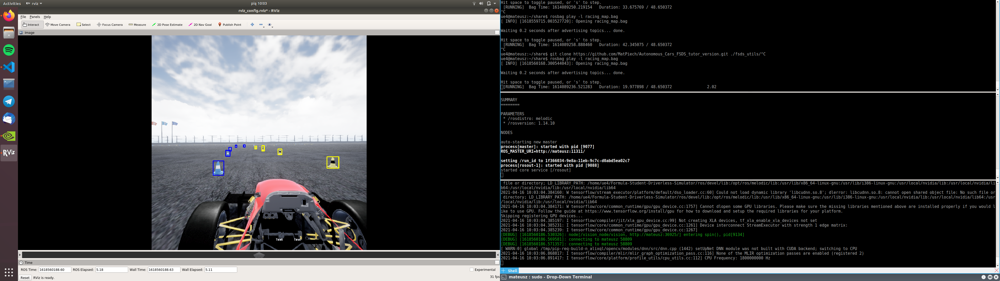

# ROS Simulator
ROS implementation of vision node for Formula Student Driverless Simulator.



## Clone repository
```bash
# go to ROS src directory
cd /home/ue4/Formula-Student-Driverless-Simulator/ros/src

# clone repository
git clone -b ros-simulator https://github.com/PUT-Motorsport/PUTM_DV_Vision_2020.git putm_dv_vision/
```

### Simulator
#### Run simulator
```bash
./FSDS.sh
```

#### Run ROS bridge to connect with simulator
```bash
roslaunch fsds_ros_bridge fsds_ros_bridge.launch
```

#### Run vision node
```bash
roslaunch putm_dv_vision vision.launch
```
